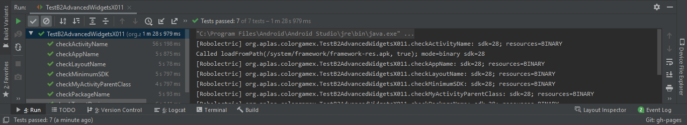
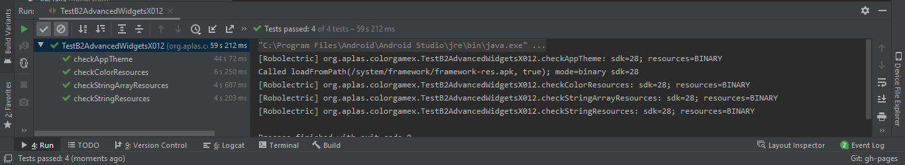
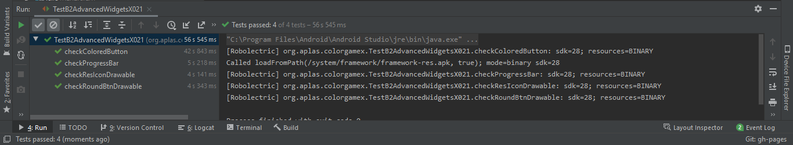
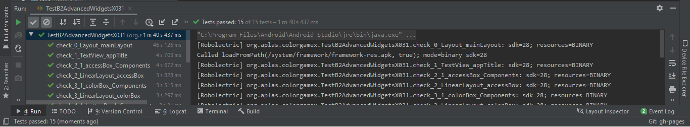
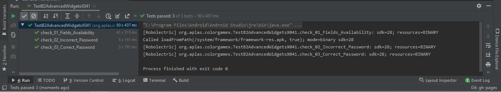
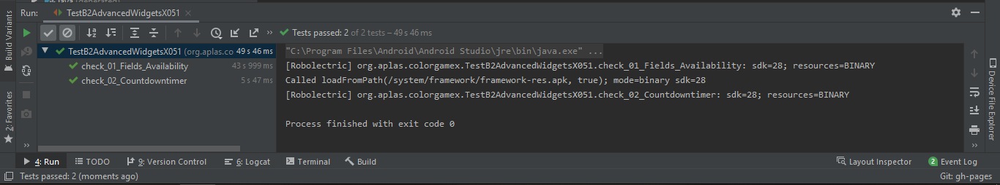
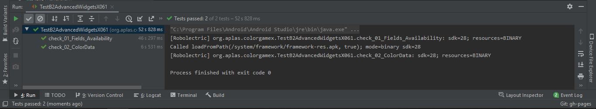
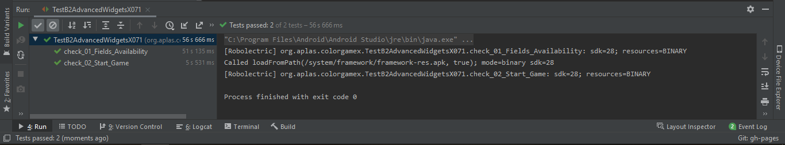
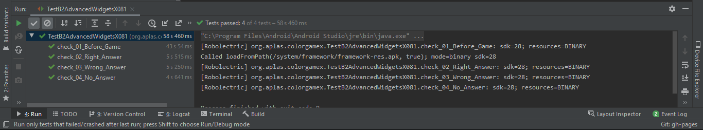
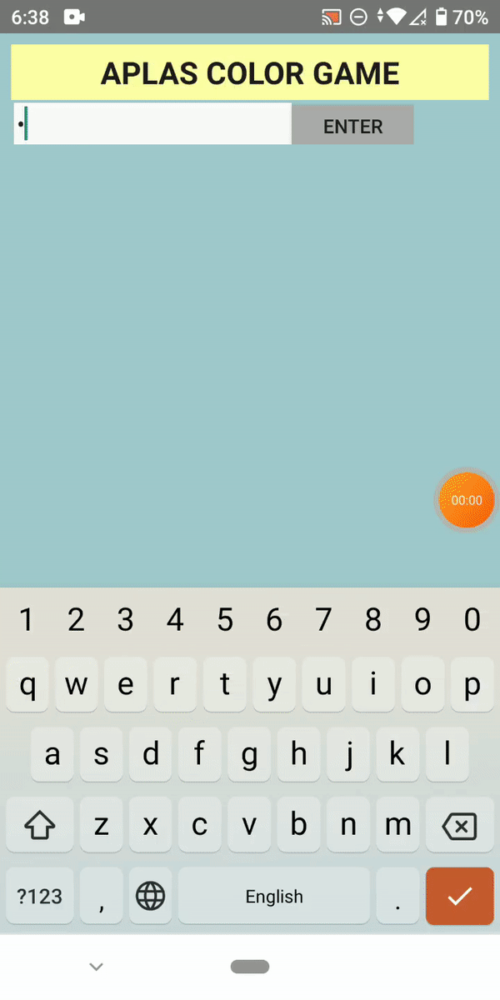

# Advanced Widgets

## Objektif

1. Pelajar memulai projek dengan membuat aplikasi sederhana game android. Dimulai dengan projek konfigurasi dan konfigurasi resource
2. Mengerti tentang style, theme, dan drawable vector image
3. Akan membuat User Interface untuk project of color game dengan onClick attribute
4. Pelajar akan mendeklarasikan fields yang dibutuhkan oleh aplikasi dan menentukan metode untuk periksa validitas untuk memasuki permainan
5. Mengerti cara kerja Countdowntimer
6. Mengerti cara mengakses array dari resource dan menaruh di List dan Hashtable
7. Pelajar mengerti cara memulai timer untuk memulai game
8. Mengerti cara menghandle timer dan mengkalkulasikan scorenya

## Deskripsi
Advanced Widgets bertujuan untuk mempelajari utilization dari widgets, timer, style, dan data structures.

## Laporan Praktikum

1. Hasil output 

2. Hasil output 

3. Hasil output 

4. Hasil output 

5. Hasil output 

6. Hasil output 

7. Hasil output 

8. Hasil output 

8. Hasil output 

## Hasil Akhir

## Pernyataan Diri

Saya menyatakan isi tugas, kode program, dan laporan praktikum ini dibuat oleh saya sendiri. Saya tidak melakukan plagiasi, kecurangan, menyalin/menggandakan milik orang lain.

Jika saya melakukan plagiasi, kecurangan, atau melanggar hak kekayaan intelektual, saya siap untuk mendapat sanksi atau hukuman sesuai peraturan perundang-undangan yang berlaku.

Ttd,

***(Abdulloh)***
