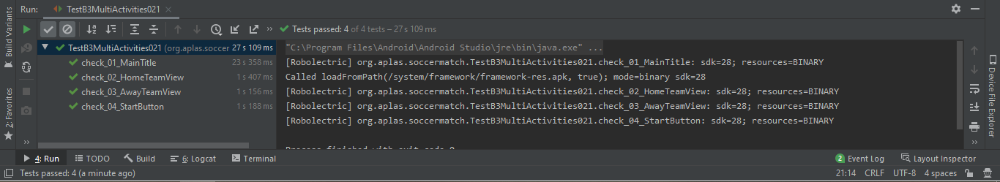
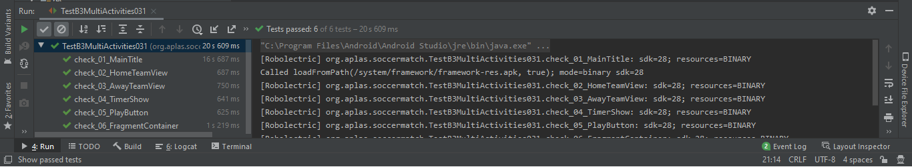
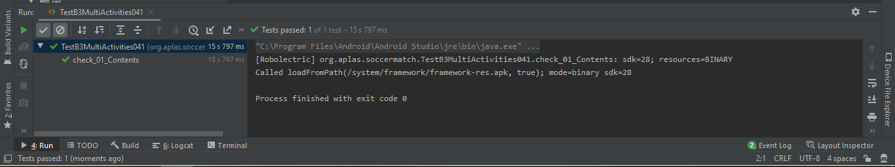
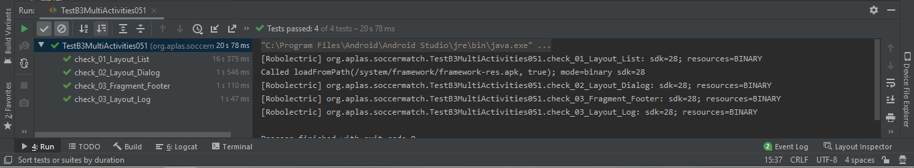
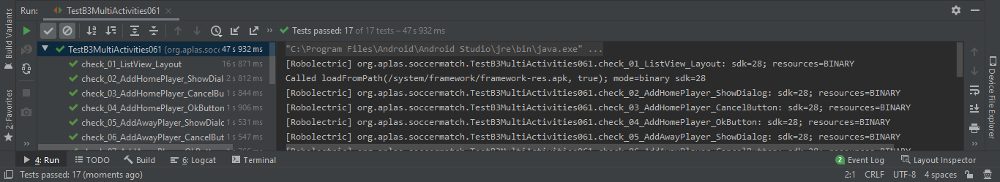
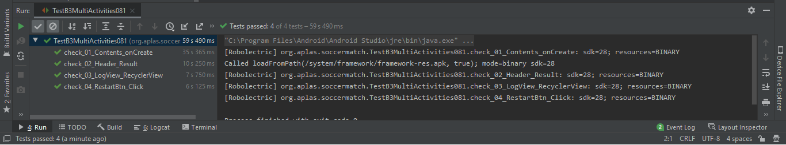
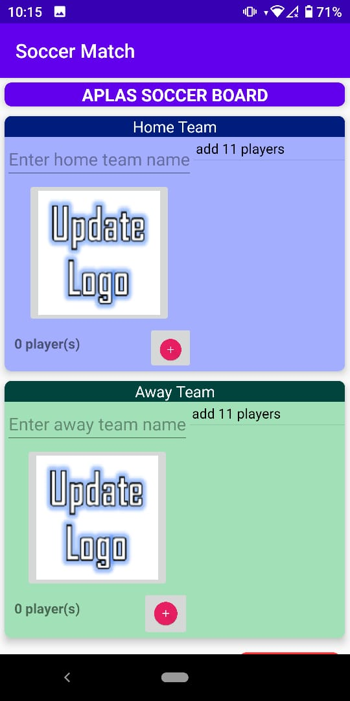

# Advanced Widgets

## Objektif

1. Siswa akan memulai proyek Android untuk membuat aplikasi Android itu Berisi beberapa kegiatan bertajuk Pertandingan Sepak Bola. Pertama dengan proyek konfigurasi dan konfigurasi sumber daya.

2. Siswa akan mulai mendesain layout utama sebagai layout pertama yang berisi CardView, ListView, ImageButton, TextView, EditText, dan Button.

3. Siswa akan mulai mendesain layout Play sebagai layout kedua yang berisi CardView, ImageButton, ImageView, TextView, Fragment Container, dan Tombol.

4. Siswa akan mulai mendesain layout Log sebagai layout ketiga yang berisi TextView, RecyclerView, dan Button.

5. Siswa akan mulai mendesain layout daftar, layout dialog, layout cocokkan log, dan tata letak fragmen footer.

6. Siswa akan mulai membuat program untuk MainActivity. Tugas ini akan memperkenalkan caranya untuk menangani ListView, buka maksud pemilih gambar, tampilkan dialog, dan buka maksud lain.

7. Siswa akan mulai membuat program untuk PlayActivity. Tugas ini akan memperkenalkan:
- cara mengumpulkan variabel Intent passing,
- cara menggunakan Timer dengan Handler,
- cara menggunakan Menu Popup, dan
- cara membuat dan mengakses Fragmen.

8. Siswa akan mulai membuat program untuk LogActivity. Tugas ini akan memperkenalkan:
- cara mengumpulkan variabel Intent passing,
- cara menggunakan RecyclerView,
- cara menggunakan adaptor View, dan
- cara memuat array sebagai tambahan Intent.

## Deskripsi
Multi Activities bertujuan untuk mempelajari bagaimana caranya membuat aplikasi dengan banyak aktivitas dengan memanfaatkan maksud dan fragmen.

## Laporan Praktikum

1. Hasil output 

2. Hasil output 

3. Hasil output 

4. Hasil output 

5. Hasil output 

6. Hasil output 

7. Hasil output 

8. Hasil output 

## Hasil Akhir

## Pernyataan Diri

Saya menyatakan isi tugas, kode program, dan laporan praktikum ini dibuat oleh saya sendiri. Saya tidak melakukan plagiasi, kecurangan, menyalin/menggandakan milik orang lain.

Jika saya melakukan plagiasi, kecurangan, atau melanggar hak kekayaan intelektual, saya siap untuk mendapat sanksi atau hukuman sesuai peraturan perundang-undangan yang berlaku.

Ttd,

***(Abdulloh)***
