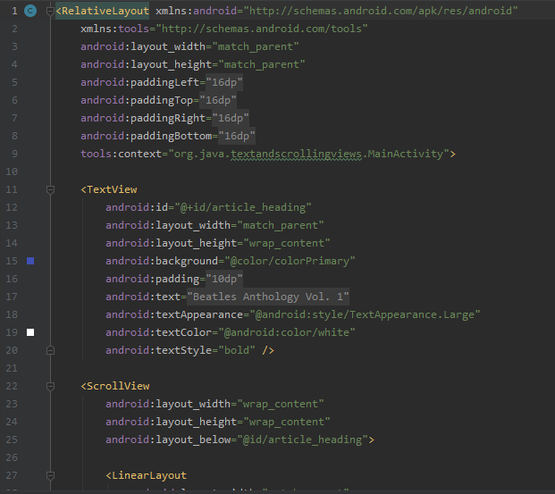

# Advanced Widgets

## Objektif
1. Mengerti cara menggunakan XML code untuk menambahkan elemen textview

2. Mengerti cara menggunakan XML code untk mendefine view

3. Mengerti cara menampilkan free-form text dengan format HTML

4. Mengerti cara merubah background color dan text color pada textview 

5. Mengerti cara memasukkan weblink di text 

## Deskripsi
The TextViewkelas adalah subclass dari Viewkelas yang menampilkan teks pada layar. Anda bisa mengontrol bagaimana teks muncul dengan TextViewatribut di file layout XML. Praktik ini menunjukkan cara bekerja dengan banyak TextViewelemen, termasuk elemen di mana pengguna dapat menggulir kontennya secara vertikal.

## Laporan Praktikum

## Hasil Akhir

## Pernyataan Diri

Saya menyatakan isi tugas, kode program, dan laporan praktikum ini dibuat oleh saya sendiri. Saya tidak melakukan plagiasi, kecurangan, menyalin/menggandakan milik orang lain.

Jika saya melakukan plagiasi, kecurangan, atau melanggar hak kekayaan intelektual, saya siap untuk mendapat sanksi atau hukuman sesuai peraturan perundang-undangan yang berlaku.

Ttd,

***(Abdulloh)***
