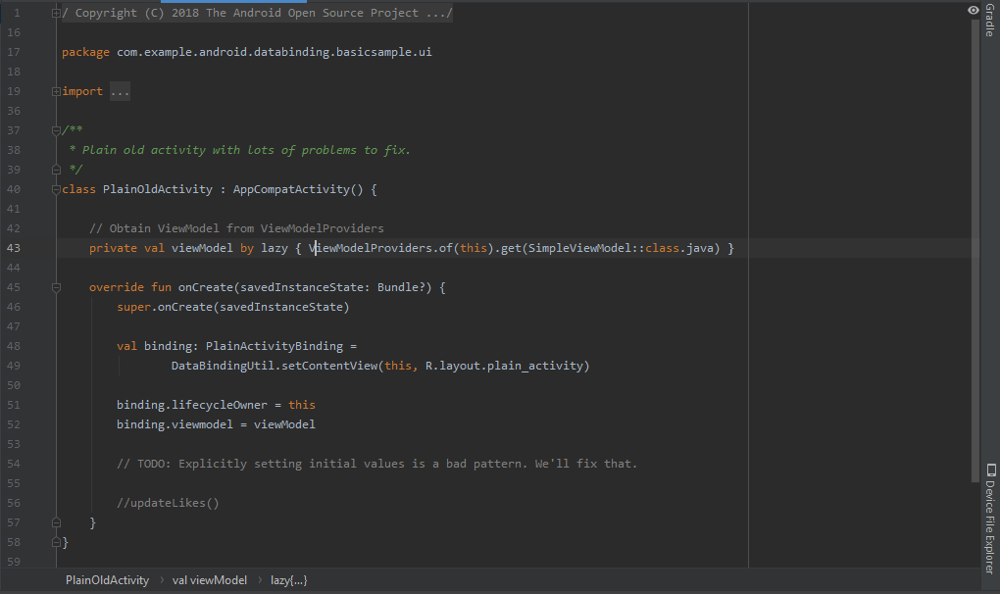
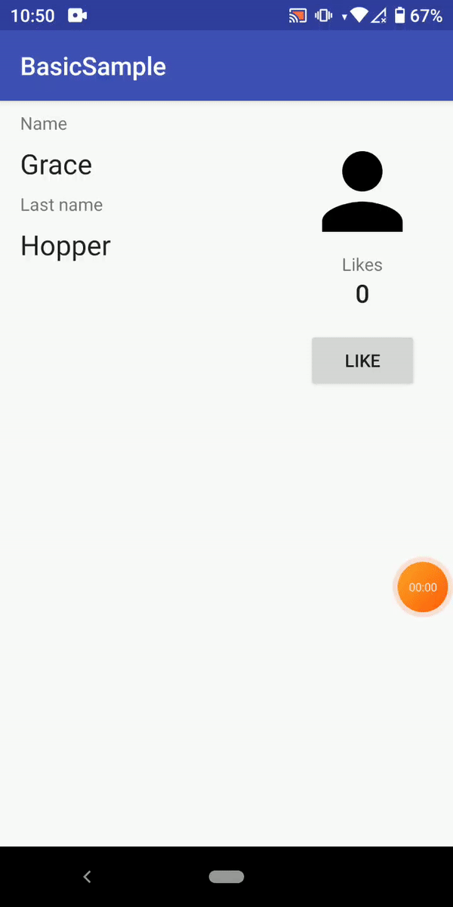

# Data Binding

## Objektif
Aplikasi memiliki satu layar yang menampilkan beberapa data statis dan beberapa data yang dapat diamati, yang berarti bahwa ketika data berubah, UI akan diperbarui secara otomatis.

Data disediakan oleh ViewModel. Model-View-ViewModel adalah pola lapisan presentasi yang bekerja sangat baik dengan Data Binding. Berikut diagramnya:

Android berkomunikasi bolak-balik dengan View.  Tampilan mengamati ViewModel dan mengirimkan tindakan pengguna ke sana.  Di luar lapisan presentasi, ada lapisan lain yang diwakili oleh interaktor atau repositori.

Jika Anda belum terbiasa dengan kelas ViewModel dari pustaka Komponen Arsitektur, Anda dapat melihat dokumentasi resmi . Singkatnya, ini adalah kelas yang menyediakan status UI ke tampilan (Aktivitas, Fragmen, dll.). Ini bertahan dari perubahan orientasi dan bertindak sebagai antarmuka ke seluruh lapisan di aplikasi Anda.

## Deskripsi
Data Binding Library adalah Android Jetpack Library yang memungkinkan Anda untuk komponen UI mengikat dalam layout XML Anda untuk sumber data dalam aplikasi menggunakan deklaratif format yang bukan pemrograman, mengurangi kode boilerplate.

## Laporan Praktikum

## Hasil Akhir

## Pernyataan Diri

Saya menyatakan isi tugas, kode program, dan laporan praktikum ini dibuat oleh saya sendiri. Saya tidak melakukan plagiasi, kecurangan, menyalin/menggandakan milik orang lain.

Jika saya melakukan plagiasi, kecurangan, atau melanggar hak kekayaan intelektual, saya siap untuk mendapat sanksi atau hukuman sesuai peraturan perundang-undangan yang berlaku.

Ttd,

***(Abdulloh)***
