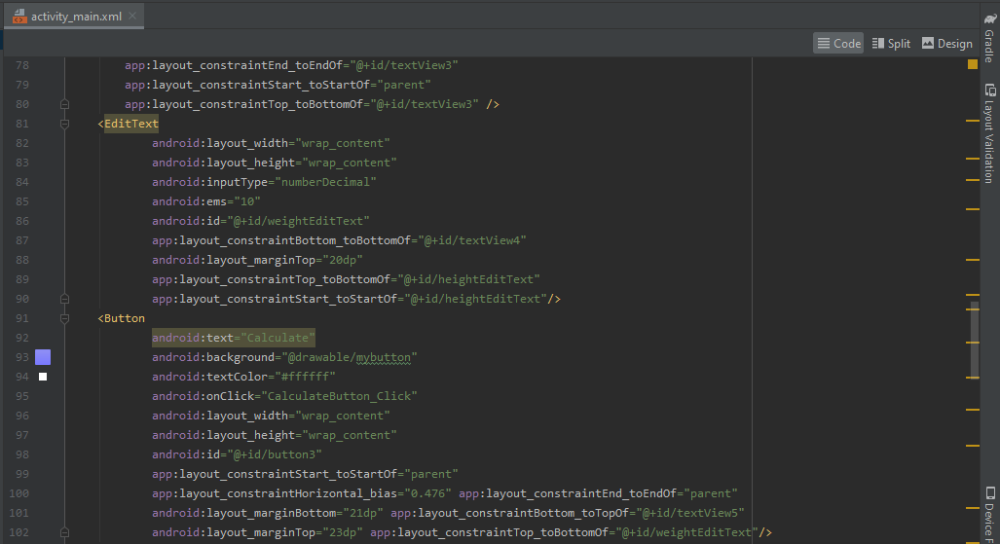
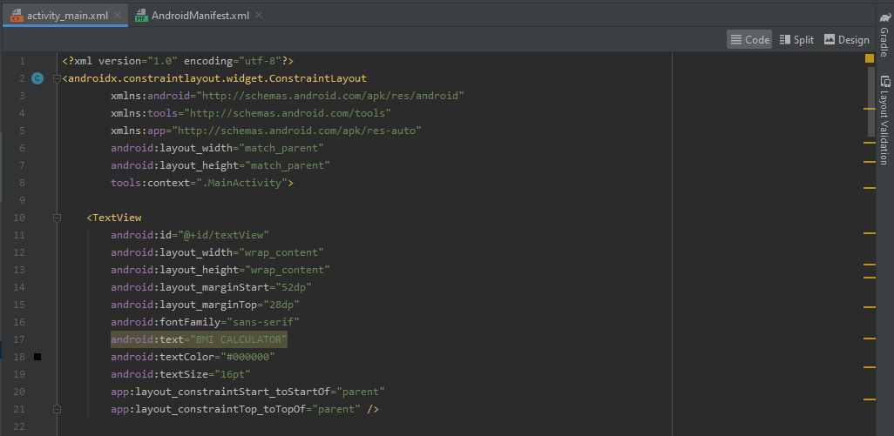
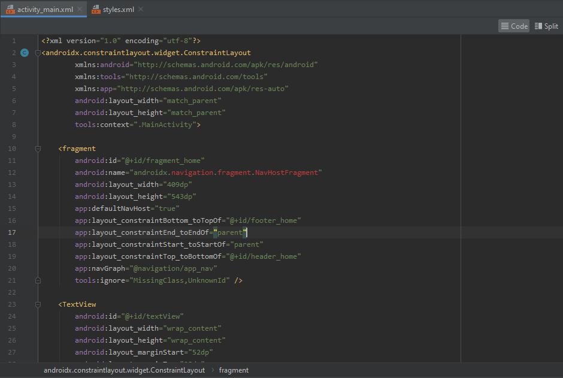
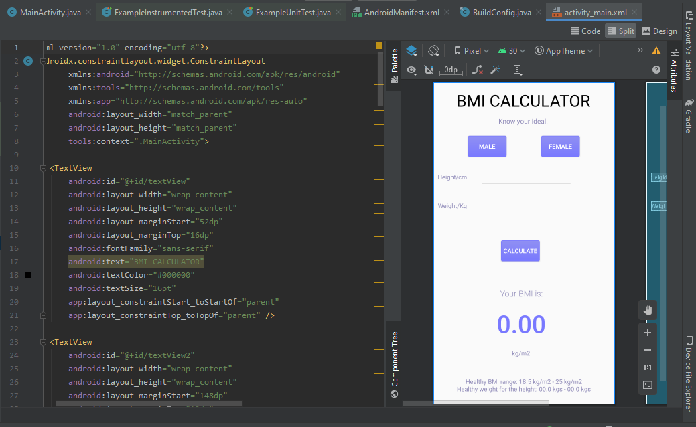

# Kuis II

## Deskripsi
Laporan hasil kuis II nomor 1

## Laporan Praktikum

1. Sample Code Data Binding

2. Sample Code View Model

3. Sample Code Fragment

4. Sample Code Navigasi

## Pernyataan Diri

Saya menyatakan isi tugas, kode program, dan laporan praktikum ini dibuat oleh saya sendiri. Saya tidak melakukan plagiasi, kecurangan, menyalin/menggandakan milik orang lain.

Jika saya melakukan plagiasi, kecurangan, atau melanggar hak kekayaan intelektual, saya siap untuk mendapat sanksi atau hukuman sesuai peraturan perundang-undangan yang berlaku.

Ttd,

***(Abdulloh)***
